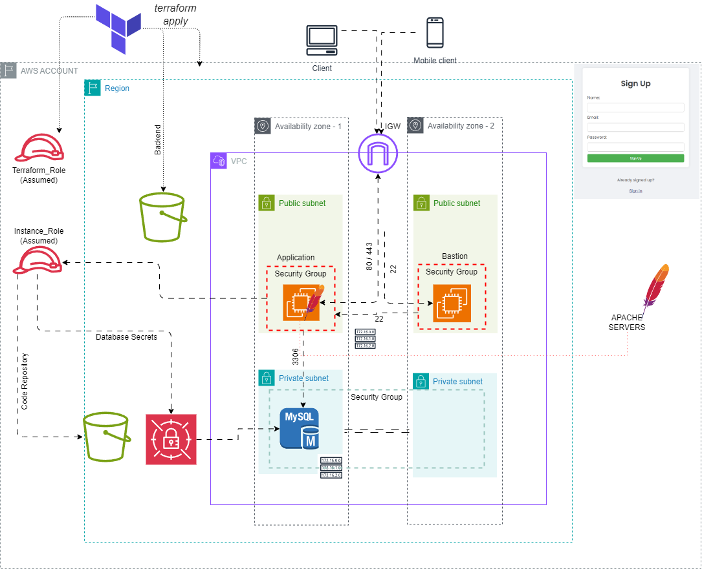

# LAMP Stack Deployment on AWS using Terraform

## Table of Contents

- [Project Overview](#project-overview)
- [Architecture Diagram](#architecture-diagram)
- [Prerequisites](#prerequisites)
- [Setup Instructions](#setup-instructions)
  - [Clone the Repository](#clone-the-repository)
  - [Initialize Terraform](#initialize-terraform)
  - [Create Secrets in AWS Secrets Manager](#create-secrets-in-aws-secrets-manager)
  - [Configure Terraform Variables](#configure-terraform-variables)
  - [Deploy the Infrastructure](#deploy-the-infrastructure)
- [Configuration Details](#configuration-details)
  - [EC2 Instances](#ec2-instances)
  - [Security Groups](#security-groups)
  - [RDS Instance](#rds-instance)
  - [IAM Roles and Policies](#iam-roles-and-policies)
  - [AWS Secrets Manager](#aws-secrets-manager)
- [Secrets Management](#secrets-management)
- [Usage](#usage)
- [Troubleshooting](#troubleshooting)
- [Contributing](#contributing)
- [License](#license)

## Project Overview

This project automates the deployment of a LAMP stack on AWS using Terraform. The LAMP stack consists of Linux, Apache, MySQL, and PHP, which are installed and configured on EC2 instances. This setup provides a robust environment for developing and hosting dynamic web applications.

## Architecture Diagram



## Prerequisites

Before you begin, ensure you have the following:

- **AWS Account:** Ensure you have an AWS account with necessary permissions to create and manage the required resources.
- **Terraform:** Install Terraform on your local machine. You can download it from the [official Terraform website](https://www.terraform.io/downloads.html).
- **AWS CLI:** Install and configure the AWS Command Line Interface (CLI) with appropriate credentials. Instructions can be found on the [AWS CLI documentation page](https://docs.aws.amazon.com/cli/latest/userguide/install-cliv2.html).
- **Text Editor:** Use a text editor or IDE for editing configuration files, such as VSCode, Sublime Text, or Atom.

## Setup Instructions

### Clone the Repository

First, clone the repository to your local machine:

```sh
git clone https://github.com/your-repo/lamp-terraform-aws.git
cd lamp-terraform-aws
```

## Initialize Terraform

Initialize Terraform to install the necessary providers and prepare your working directory:

#### terraform init

## Create Secrets in AWS Secrets Manager

Navigate to the AWS Secrets Manager console and create secrets for your database credentials and other sensitive information:

- Create a new secret: In AWS Secrets Manager, click on "Store a new secret."
  Select secret type: Choose "Other type of secrets."
- Add secret details: Enter the key-value pairs for your secrets, such as:
- - db_username: admin
- - db_password: yourpassword
- Name the secret: Give your secret a meaningful name, e.g., mydbpassword.
- Save the secret: Note the ARN of the secret created.

### Configure Terraform Variables

Update the terraform.tfvars file with your specific configuration details, including the ARNs of the secrets created. An example configuration might look like this:

- aws_region = "us-west-2"

- db_secret_arn = "arn:aws:secretsmanager:us-west-2:123456789012:secret:mydbpassword"

### Deploy the Infrastructure

Apply the Terraform configuration to deploy the infrastructure:

- terraform apply
  When prompted, type yes to confirm the deployment.

# Configuration Details

## EC2 Instances

The Terraform configuration sets up EC2 instances running Amazon Linux 2, configured with Apache, MySQL, and PHP:

- Instance Type: t2.micro (suitable for free tier)
- Operating System: Amazon Linux 2
- Installed Software: Apache, MySQL, PHP

## Security Groups

Security groups are configured to allow the necessary traffic:

### Web Server Security Group:

- Port 22 (SSH): Restricted to your IP address
- Port 80 (HTTP): Open to the internet

### Database Security Group:

- Port 3306 (MySQL): Restricted to the web server security group

## RDS Instance

An RDS instance is configured for MySQL, with the following specifications:

- Engine: MySQL
- Instance Class:
- Allocated Storage:
- Database Name:
- Master Username: admin (from AWS Secrets Manager)
- Master Password: Retrieved securely from AWS Secrets Manager

## IAM Roles and Policies

IAM roles and policies are created to provide necessary permissions to the EC2 instances for accessing AWS resources:

- EC2 Role: Allows EC2 instances to interact with AWS Secrets Manager
- Policy: Attached to the EC2 role to grant specific permissions

## AWS Secrets Manager

Secrets are securely stored and managed in AWS Secrets Manager, ensuring sensitive information is not exposed in the configuration files.

## Secrets Management

Secrets are managed using AWS Secrets Manager. The secrets are accessed directly in the Terraform configuration to ensure sensitive data is securely managed and retrieved.

Example of accessing a secret in Terraform:

data "aws_secretsmanager_secret_version" "db_password" {
secret_id = var.db_secret_arn
}

resource "aws_db_instance" "default" {
allocated_storage = 20
engine = "mysql"
engine_version = "8.0"
instance_class = "db.t2.micro"
name = "mydatabase"
username = "admin"
password = data.aws_secretsmanager_secret_version.db_password.secret_string
parameter_group_name = "default.mysql8.0"
skip_final_snapshot = true
}

## Usage

Once the infrastructure is deployed, you can access the web application via the public DNS of the EC2 instance running Apache. The database can be managed using the RDS endpoint provided in the Terraform output.

## Troubleshooting

- Terraform Errors: Ensure that your AWS credentials are correctly configured and have the necessary permissions.
- EC2 Access Issues: Verify that the security group rules allow SSH and HTTP access.
- Database Connectivity: Ensure the RDS instance is up and the security group rules allow database connections.
